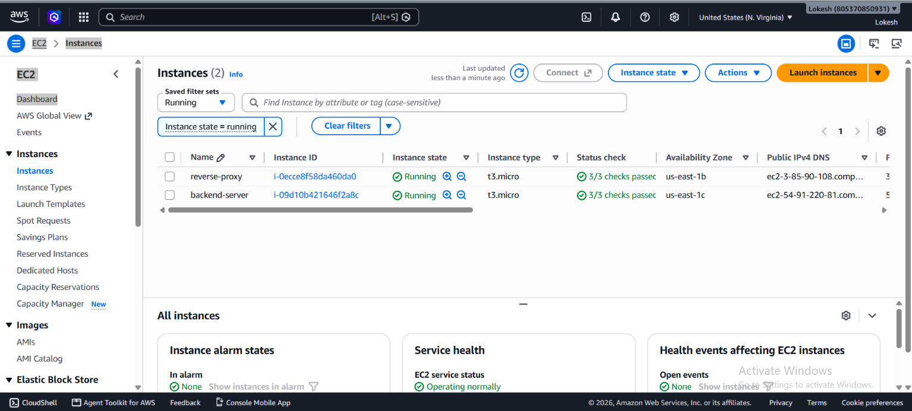
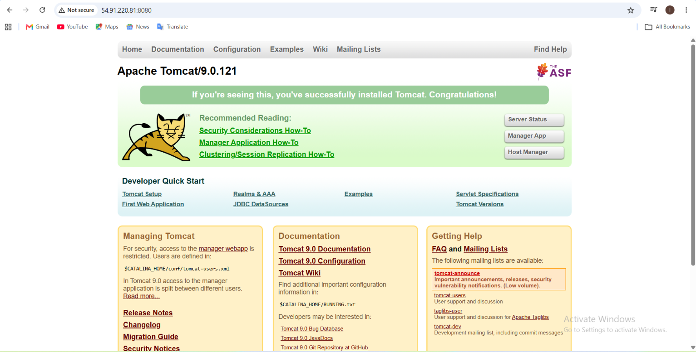
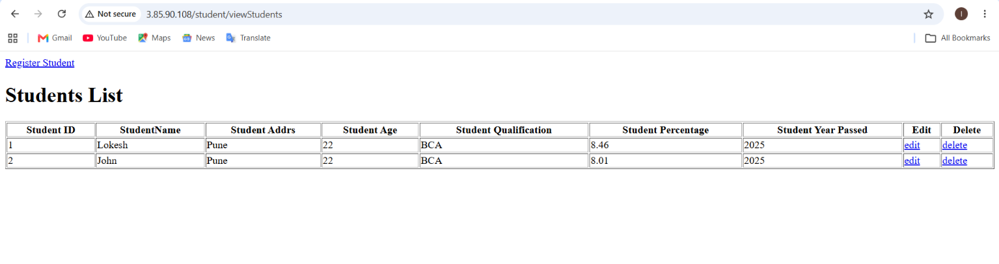

# Cravita Internship – Project 1: Java Application Deployment with Reverse Proxy on AWS

## 📌 Project Overview

This project demonstrates the deployment of a Java-based Student Registration Web Application on Amazon Web Services (AWS) using a two-tier EC2 architecture with an Nginx Reverse Proxy and Amazon RDS MySQL database.

The application is deployed on an Ubuntu EC2 backend server using Apache Tomcat. Nginx is configured on a separate EC2 instance as a reverse proxy. The application connects to Amazon RDS MySQL for storing and retrieving student registration data.

The final application is accessed through the Reverse Proxy EC2 public IP instead of directly accessing the backend application server.

---

## 🏗️ Architecture

### Architecture Flow

User Browser
↓
Nginx Reverse Proxy EC2
↓
Backend EC2 – Apache Tomcat :8080
↓
Amazon RDS MySQL
↓
Student Registration Database

---

## 🎯 Project Objectives

- Deploy a Java WAR application on AWS EC2.
- Configure Apache Tomcat as the Servlet container.
- Deploy `student.war` application.
- Configure Amazon RDS MySQL database.
- Connect Java application with RDS using MySQL Connector/J.
- Configure JNDI DataSource in Tomcat.
- Deploy Nginx on a separate EC2 instance.
- Configure Nginx as a Reverse Proxy.
- Restrict direct access to the backend application.
- Access the application through the Reverse Proxy.
- Store and retrieve student registration data from RDS MySQL.

---

## ☁️ AWS Infrastructure

### Backend EC2

- Instance Name: `backend-server`
- Instance Type: `t3.micro`
- Operating System: Ubuntu
- Public IP: `54.91.220.81`
- Private IP: `172.31.20.55`
- Application Port: `8080`
- Application Server: Apache Tomcat
- Application: `student.war`

### Reverse Proxy EC2

- Instance Name: `reverse-proxy`
- Instance Type: `t3.micro`
- Operating System: Ubuntu
- Public IP: `3.85.90.108`
- Private IP: `172.31.92.122`
- Reverse Proxy: Nginx
- Public Application Port: `80`

### Database

- Database Service: Amazon RDS
- Engine: MySQL
- Database Name: `studentdb`
- Database User: `admin`
- Database Table: `students`

---

## 📸 EC2 Instances

The project uses two EC2 instances:

1. Backend Server
2. Reverse Proxy Server

The backend EC2 hosts the Java application while the Reverse Proxy EC2 handles public HTTP requests.

---

## ☕ Apache Tomcat Setup

Apache Tomcat is installed on the backend EC2 instance and used to run the Java WAR application.

Tomcat is located at:

    /opt/tomcat

Tomcat runs internally on:

    http://172.31.20.55:8080

The application is deployed under the `/student` context.

### Tomcat Application URL

    http://172.31.20.55:8080/student/

---

## 📸 Tomcat Running

The screenshot shows the Tomcat server process running successfully on the backend EC2 instance.

---

## 📦 WAR Application Deployment

The Java application WAR file is:

    student.war

It is deployed inside:

    /opt/tomcat/webapps/

After deployment, Tomcat automatically extracts the application into:

    /opt/tomcat/webapps/student/

The application is therefore available using the `/student` context path.

---

## 📸 student.war Deployed

.png)

---

## 🗄️ Amazon RDS MySQL Database

Amazon RDS MySQL is used as the backend database for the Student Registration application.

### RDS Endpoint

    student-db.c41mk4mean95.us-east-1.rds.amazonaws.com

### Database

    studentdb

### Database User

    admin

The Java application connects to the RDS MySQL database using a Tomcat JNDI DataSource.

---

## 🧱 Database Table

The application uses the following table:

    students

### Table Structure

| Column | Description |
|---|---|
| student_id | Primary Key |
| student_name | Student Name |
| student_addr | Student Address |
| student_age | Student Age |
| student_qual | Qualification |
| student_percent | Percentage |
| student_year_passed | Year Passed |

---

## 📸 Final MySQL Table Structure

---

## 📝 Database Records

Student registration data is stored in the RDS MySQL `students` table.

Example SQL query:

    SELECT * FROM students;

The application inserts student details into the database when the registration form is submitted.

---

## 📸 MySQL Data

---

## 🔌 MySQL Connector/J

MySQL Connector/J is required for communication between the Java application and MySQL database.

The Connector/J JAR file is placed inside the Tomcat library directory:

    /opt/tomcat/lib/mysql-connector-j-26.7.0.jar

This allows Tomcat and the Java application to communicate with Amazon RDS MySQL.

---

## 📸 Database Table Evidence

---

## 🔗 Tomcat JNDI DataSource

The application uses the following JNDI DataSource name:

    jdbc/TestDB

The Java application accesses the DataSource through:

    java:comp/env/jdbc/TestDB

The database connection contains:

    driverClassName = com.mysql.cj.jdbc.Driver

    database = studentdb

    username = admin

The password is kept private and is not exposed in this repository.

---

## 🌐 Nginx Reverse Proxy

Nginx is installed on the separate Reverse Proxy EC2 instance.

Nginx listens publicly on HTTP port:

    80

It forwards requests from:

    /student/

to the backend Tomcat application:

    http://172.31.20.55:8080/student/

### Nginx Configuration

The Nginx server configuration is:

    server {
        listen 80;
        server_name _;

        location /student/ {
            proxy_pass http://172.31.20.55:8080/student/;
            proxy_set_header Host $host;
            proxy_set_header X-Real-IP $remote_addr;
            proxy_set_header X-Forwarded-For $proxy_add_x_forwarded_for;
            proxy_set_header X-Forwarded-Proto $scheme;
        }
    }

The configuration was tested using:

    sudo nginx -t

The Nginx configuration test completed successfully.

---

## 📸 Nginx Running

.png)

---

## 🔐 Security Group Configuration

The project uses separate Security Groups for the Backend and Reverse Proxy EC2 instances.

### Reverse Proxy Security Group

Publicly accessible:

- HTTP – Port 80
- SSH – Port 22

Port 8080 is not exposed publicly on the Reverse Proxy.

### Backend Security Group

The backend application runs on port 8080.

Port 8080 access is restricted to the Reverse Proxy Security Group.

This means the backend application is intended to receive application traffic from the Reverse Proxy instead of direct public access.

---

## 🔒 Backend Direct Access Restriction

Direct access to the backend application:

    http://54.91.220.81:8080/student/

was tested after applying the security restriction.

The direct public request is blocked and results in a connection timeout.

This confirms that the application is accessed through the Reverse Proxy.

---

## 📸 Backend Direct Access Blocked

---

## 🚀 Final Application URL

The final application is accessed through the Nginx Reverse Proxy EC2 instance:

    http://3.85.90.108/student/

Users do not need to access the backend Tomcat server directly.

---

## 📸 Final Student Registration Application

.png)

---

## 🔄 Application Request Flow

When a user opens the application:

    User Browser
        ↓
    Reverse Proxy EC2
        ↓
    Nginx :80
        ↓
    Backend EC2
        ↓
    Tomcat :8080
        ↓
    student.war
        ↓
    JNDI DataSource
        ↓
    Amazon RDS MySQL
        ↓
    students table

---

## 🧪 Application Testing

The following tests were performed successfully.

### Test 1 – Tomcat

Tomcat was started successfully on the backend EC2 server.

Status:

    SUCCESS

### Test 2 – WAR Deployment

`student.war` was deployed successfully under:

    /opt/tomcat/webapps/student/

Status:

    SUCCESS

### Test 3 – Database Connection

The Java application successfully connected to Amazon RDS MySQL.

Status:

    SUCCESS

### Test 4 – Student Registration

Student details were entered through the web application and stored in the database.

Status:

    SUCCESS

### Test 5 – Database Verification

The following SQL query was used:

    SELECT * FROM students;

The inserted records were displayed successfully.

Status:

    SUCCESS

### Test 6 – Nginx Reverse Proxy

Nginx successfully forwarded requests from the public Reverse Proxy IP to the backend Tomcat server.

Status:

    SUCCESS

### Test 7 – Backend Direct Access

Direct public access to backend port 8080 was blocked after applying the security restriction.

Status:

    SUCCESS

---

## 📸 Project Screenshots

### 1. EC2 Instances

### 2. Tomcat Running

### 3. WAR Deployment

.png)

### 4. Database Table Structure

### 5. Database Records

### 6. Database Table Evidence

### 7. Nginx Running

.png)

### 8. Final Application

.png)

### 9. Backend Direct Access Blocked

### 10. Architecture Diagram

---

## 🛠️ Technologies Used

### Cloud

- Amazon Web Services (AWS)
- Amazon EC2
- Amazon RDS

### Application

- Java
- JSP
- Servlet
- WAR
- Apache Tomcat

### Database

- MySQL
- Amazon RDS MySQL
- JDBC
- MySQL Connector/J
- JNDI DataSource

### Web Server / Reverse Proxy

- Nginx

### Operating System

- Ubuntu Linux

---

## 📁 Important Project Components

    /opt/tomcat/
    ├── bin/
    ├── conf/
    ├── lib/
    │   └── mysql-connector-j-26.7.0.jar
    └── webapps/
        ├── student.war
        └── student/

---

## 📊 Project Result

The Java Student Registration Web Application was successfully deployed on AWS using a two-EC2 architecture.

The backend application runs on Apache Tomcat and connects to Amazon RDS MySQL for persistent data storage.

Nginx is configured as a Reverse Proxy on a separate EC2 instance.

The final application is accessible through:

    http://3.85.90.108/student/

Student registration data is successfully stored and retrieved from the RDS MySQL database.

Direct public access to the backend application on port 8080 is restricted.

---

## ✅ Project Outcome

- Java application successfully deployed on AWS EC2.
- Apache Tomcat successfully configured.
- `student.war` successfully deployed.
- Amazon RDS MySQL successfully integrated.
- MySQL Connector/J successfully configured.
- JNDI DataSource successfully configured.
- Student registration data successfully stored in RDS.
- Nginx successfully configured as Reverse Proxy.
- Public application access provided through Reverse Proxy.
- Direct backend application access restricted.
- End-to-end application flow tested successfully.

---

## 👨‍💻 Internship Project

**Organization:** Cravita Technology

**Project:** Java Application Deployment with Reverse Proxy on AWS

**Role:** Cloud & DevOps Trainee

**Technologies:** AWS, Linux, Apache Tomcat, Java, MySQL, Amazon RDS, Nginx, JDBC, JNDI

---

## 📌 Final Summary

This project demonstrates a practical AWS deployment architecture where a Java web application is hosted on a backend EC2 instance and exposed through a separate Nginx Reverse Proxy EC2 instance.

Amazon RDS MySQL is used as the persistent database layer.

The architecture provides separation between the public reverse proxy layer and the backend application layer while demonstrating practical Cloud and DevOps concepts such as EC2, Security Groups, Linux, Tomcat deployment, database connectivity, Nginx reverse proxy configuration, and application testing.

**Final Application:**

    http://3.85.90.108/student/

**Project Status:**

    COMPLETED ✅
