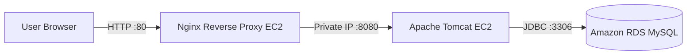

# Cravita Internship – Project 1: Java Application Deployment with Reverse Proxy on AWS

## 📌 Project Overview

This project demonstrates the deployment of a Java Student Registration Web Application on AWS using two Linux EC2 instances, Apache Tomcat, Nginx Reverse Proxy, and Amazon RDS MySQL.

The application is deployed as a WAR file on the backend EC2 instance and is accessed publicly only through the Nginx reverse proxy server.

---

# 🏗️ Architecture Diagram



---

# 🔄 Traffic Flow

```text
User Browser
      │
      │ HTTP :80
      ▼
Nginx Reverse Proxy
      │
      │ Private IP :8080
      ▼
Apache Tomcat
      │
      │ JDBC :3306
      ▼
Amazon RDS MySQL
```

---

# 🎯 Project Objectives

- Deploy Java WAR application on AWS EC2
- Host application using Apache Tomcat
- Configure Amazon RDS MySQL
- Install MySQL Connector/J
- Configure Nginx Reverse Proxy
- Restrict backend access using Security Groups
- Access application only through Nginx

---

# ☁️ AWS Infrastructure

## Backend EC2

| Property | Value |
|---|---|
| Instance Name | backend-server |
| OS | Ubuntu |
| Instance Type | t3.micro |
| Public IP | 54.91.220.81 |
| Private IP | 172.31.20.55 |
| Application Server | Apache Tomcat 9 |
| Port | 8080 |

## Reverse Proxy EC2

| Property | Value |
|---|---|
| Instance Name | reverse-proxy |
| OS | Ubuntu |
| Instance Type | t3.micro |
| Public IP | 3.85.90.108 |
| Private IP | 172.31.92.122 |
| Web Server | Nginx |
| Port | 80 |

---

# ☕ Java Application Deployment

**Application:** `student.war`

Deployment location:

```text
/opt/tomcat/webapps/student.war
```

Tomcat extracted application:

```text
/opt/tomcat/webapps/student/
```

Application Context:

```text
/student
```

---

# 🐱 Apache Tomcat

Tomcat Installation:

```text
/opt/tomcat
```

Start Tomcat:

```bash
cd /opt/tomcat
sudo ./bin/startup.sh
```

Verify:

```bash
ps aux | grep tomcat
```

Tomcat runs on **Port 8080**.

---

# 🗄️ Amazon RDS MySQL

| Property | Value |
|---|---|
| Engine | MySQL |
| Database | studentdb |
| Username | admin |
| Port | 3306 |

RDS Endpoint:

```text
student-db.c41mk4mean95.us-east-1.rds.amazonaws.com
```

---

# 📋 Database Schema

```sql
CREATE TABLE students (
    student_id INT PRIMARY KEY AUTO_INCREMENT,
    student_name VARCHAR(100) NOT NULL,
    student_addr VARCHAR(255) NOT NULL,
    student_age VARCHAR(20) NOT NULL,
    student_qual VARCHAR(100) NOT NULL,
    student_percent VARCHAR(20) NOT NULL,
    student_year_passed VARCHAR(20) NOT NULL
);
```

---

# 🔍 Database Verification

```sql
USE studentdb;

SELECT * FROM students;
```

Sample Records:

| ID | Name | Address | Age | Qualification | Percentage | Year |
|---|---|---|---|---|---|---|
| 1 | Lokesh | Pune | 22 | BCA | 8.46 | 2025 |
| 2 | John | Pune | 22 | BCA | 8.01 | 2025 |

---

# 🔌 MySQL Connector/J

Connector File:

```text
mysql-connector-j-26.7.0.jar
```

Location:

```text
/opt/tomcat/lib/mysql-connector-j-26.7.0.jar
```

Verify:

```bash
ls -lh /opt/tomcat/lib/mysql-connector-j-26.7.0.jar
```

---

# 🔗 Tomcat JNDI Configuration

File:

```text
/opt/tomcat/conf/context.xml
```

Configuration:

```xml
<Context>

<Resource
name="jdbc/TestDB"
auth="Container"
type="javax.sql.DataSource"
driverClassName="com.mysql.cj.jdbc.Driver"
url="jdbc:mysql://student-db.c41mk4mean95.us-east-1.rds.amazonaws.com:3306/studentdb"
username="admin"
password="YOUR_DATABASE_PASSWORD"
maxTotal="20"
maxIdle="10"
maxWaitMillis="-1"/>

</Context>
```

> Database password is intentionally hidden.

---

# 🌐 Nginx Reverse Proxy

Configuration File:

```text
/etc/nginx/sites-available/student
```

```nginx
server {
    listen 80;
    server_name _;

    location /student/ {
        proxy_pass http://172.31.20.55:8080/student/;

        proxy_set_header Host $host;
        proxy_set_header X-Real-IP $remote_addr;
        proxy_set_header X-Forwarded-For $proxy_add_x_forwarded_for;
        proxy_set_header X-Forwarded-Proto $scheme;
    }
}
```

Enable Configuration:

```bash
sudo ln -s /etc/nginx/sites-available/student /etc/nginx/sites-enabled/student
```

---

# ✅ Nginx Validation

```bash
sudo nginx -t
```

Expected Output:

```text
nginx: the configuration file /etc/nginx/nginx.conf syntax is ok
nginx: configuration file /etc/nginx/nginx.conf test is successful
```

Check Service:

```bash
sudo systemctl status nginx
```

Status:

```text
Active: active (running)
```

---

# 🔐 Security Configuration

## Reverse Proxy EC2

Allowed Ports:

- SSH (22)
- HTTP (80)

## Backend EC2

Allowed Ports:

- SSH (22)
- HTTP (80)
- HTTPS (443)
- Tomcat (8080) **Only from Reverse Proxy Security Group**

Architecture:

```text
Internet
    │
    │ Port 80
    ▼
Nginx Reverse Proxy
    │
    │ Private IP :8080
    ▼
Apache Tomcat
```

Direct backend access is blocked.

Blocked URL:

```text
http://54.91.220.81:8080/student/
```

Result:

```text
ERR_CONNECTION_TIMED_OUT
```

---

# 🌍 Final Application URL

Student Registration:

```text
http://3.85.90.108/student/
```

Students List:

```text
http://3.85.90.108/student/viewStudents
```

---

# 🧪 Testing Performed

## Test 1 – Tomcat

```bash
ps aux | grep tomcat
```

Result: Tomcat Running

## Test 2 – WAR Deployment

```bash
ls /opt/tomcat/webapps/
```

Result:

- student.war
- student/

## Test 3 – Database

```sql
SELECT * FROM students;
```

Result: Student records displayed successfully.

## Test 4 – Nginx

```bash
sudo nginx -t
```

Result: Configuration successful.

## Test 5 – Backend Connectivity

```bash
curl -I http://172.31.20.55:8080/student/
```

Result:

```text
HTTP/1.1 200 OK
```

## Test 6 – Public Access

```text
http://3.85.90.108/student/
```

Result: Application working successfully.

## Test 7 – Backend Security

```text
http://54.91.220.81:8080/student/
```

Result:

```text
Connection Timed Out
```

---

# 📸 Screenshots

Place the following images inside a folder named **screenshots**.

```text
screenshots/
│
├── 01-ec2-instances.png
├── 02-tomcat-running.png
├── 03-war-deployment.png
├── 04-database-table.png
├── 05-database-records.png
├── 06-mysql-connector.png
├── 07-nginx-config.png
├── 08-nginx-test.png
├── 09-nginx-service.png
├── 10-student-registration.png
├── 11-students-list.png
└── 12-backend-blocked.png
```

---

# 🛠️ Technologies Used

- Amazon EC2
- Amazon RDS MySQL
- Ubuntu Linux
- Apache Tomcat 9
- Java Servlet & JSP
- JDBC
- MySQL Connector/J
- Nginx
- AWS Security Groups
- GitHub

---

# 📊 Project Outcome

The project was successfully completed with:

- Two EC2 instances
- Apache Tomcat deployment
- Java WAR application
- Amazon RDS MySQL integration
- MySQL Connector/J configuration
- Nginx Reverse Proxy
- Private IP communication
- Security Group restriction
- Public access through Nginx
- Successful student registration
- Successful database storage and retrieval

---

# 👨‍💻 Internship Details

**Organization:** Cravita Technology

**Internship:** AWS & DevOps Internship

**Project:** Project 1

**Title:** Java Application Deployment with Reverse Proxy on AWS

**Author:** Lokesh Dharasange
